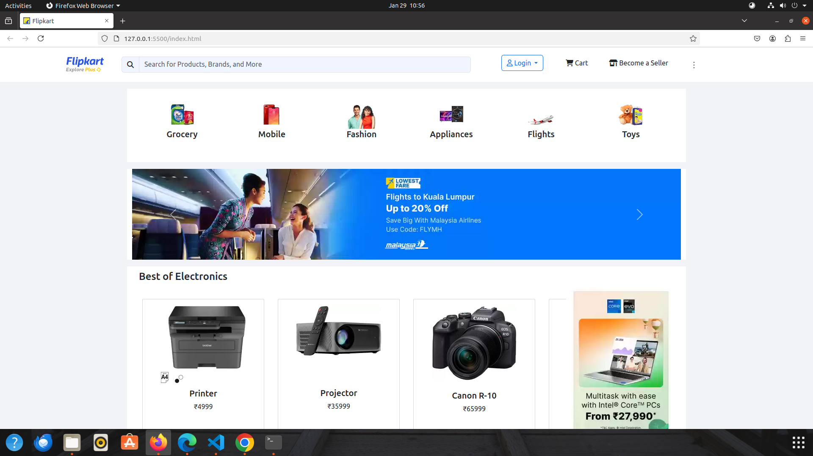
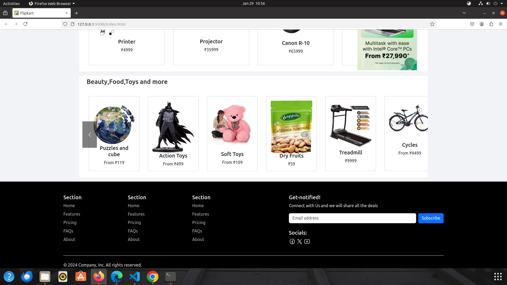
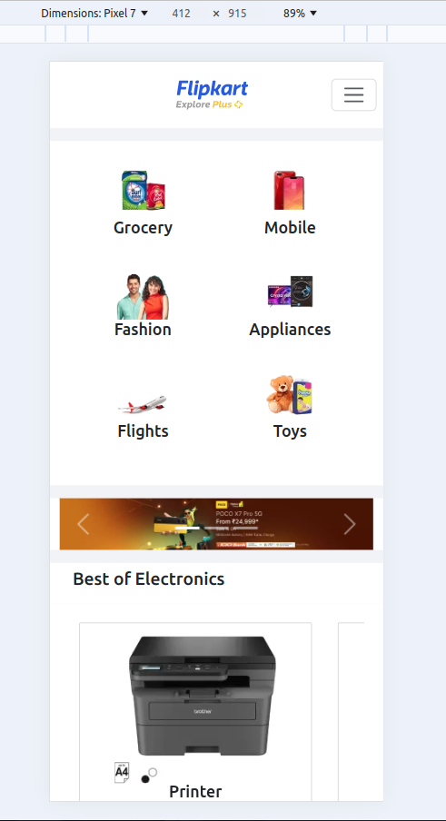

# Flipkart-homepage

This project is a **fully responsive replica** of the Flipkart homepage, built using **HTML, CSS, and JavaScript**. The design adapts to different screen sizes, including **PC, Tablet, and Mobile**, ensuring a seamless user experience.

---

## 📌 Features

- ✅ **Responsive Navigation Bar** with category dropdown
- ✅ **Homepage Carousel** for featured products
- ✅ **Product Listings** displayed in a grid format
- ✅ **Adaptive Layout** for PC, Tablet, and Mobile screens

---

## 🛠️ Technologies Used

- 🏗 **HTML** - Structuring the webpage
- 🎨 **CSS** - Styling and responsiveness
- ⚡ **Bootstrap** - Styling and responsiveness

---

## 📸 Screenshots

### 🖥 PC View




### 📱 Tablet View


### 📲 Mobile View


---

## 🚀 How to Run

```sh
# Clone the repository
git clone https://github.com/your-repo/flipkart-homepage.git

# Navigate to project directory
cd flipkart-homepage

# Open index.html in a web browser
open index.html
